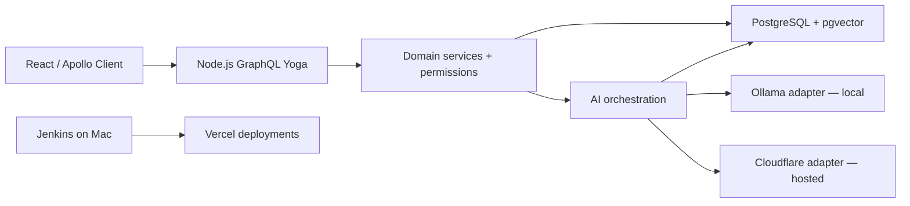

# Architecture and security

## Fixed implementation choices

| Layer | Choice | Reason |
|---|---|---|
| Frontend | React, TypeScript strict, Vite, React Router, Apollo Client | Explicit React project and typed GraphQL operations |
| Forms/UI | React Hook Form + Zod, Tailwind CSS, small accessible Radix primitives, Lucide icons | Substantial UI work without building basic accessibility primitives |
| API | Node.js LTS, TypeScript, GraphQL Yoga, graphql, GraphQL Code Generator | Framework-light Node services and schema-first contract |
| Database | PostgreSQL + pgvector, Drizzle ORM + pg, SQL migrations | Visible relational/ORM work plus vector retrieval |
| Tokenisation | @huggingface/tokenizers with pinned local tokenizer assets | Model-aware budgets without bundling an inference runtime |
| AI | Own TypeScript services; native fetch adapters for Ollama and Cloudflare REST | Provider-neutral domain logic, visible learning |
| Tests | Vitest, React Testing Library, Playwright, autocannon, Lighthouse CLI | Functional and performance evidence |
| Runtime | Node.js 24 LTS baseline; exact supported versions pinned at M0 | Reproducible local and hosted builds |
| Local infrastructure | PostgreSQL/pgvector through Docker Compose; Ollama native macOS | Keep GPU inference out of the container VM |
| Hosting/CI | Vercel Hobby, Neon Free, Cloudflare Free; Jenkins local at M7 | Agreed no-spend architecture |

At M0 verify Node 24 support and choose compatible stable package versions once; commit a lockfile. Do not replace the stack simply because another framework is fashionable.

## Request flow



Vercel serves the compiled SPA and /api/graphql from the same origin. The local server exposes the same schema; Vite proxies /api to it. Keep health routes ahead of SPA fallback: GET /api/health returns version/environment without secrets; GET /api/ready runs a short SELECT 1 and returns ready/unavailable.

Suggested layout to create during implementation:

```text
api/graphql.ts                 Vercel Node entrypoint
api/health.ts
api/ready.ts
src/client/                    React routes, components and generated operations
src/server/
  graphql/                     context, resolvers, GraphQL limits
  services/                    auth, tickets, articles, insights
  repositories/                Drizzle and explicit measured SQL
  ai/                          orchestration, prompts, adapters, tool registry
  db/                          schema and migrations
  local.ts                     standalone local HTTP entrypoint
src/shared/                    validation schemas and safe shared types
contracts/schema.graphql       source of truth; codegen consumes it
fixtures/                      synthetic corpus and development tickets
evaluation/                    dev/test labels, runner, reports
scripts/                       seeding, indexing, cleanup, measurement and deploy
tests/                         integration and browser tests
docs/
Jenkinsfile                    created in M7
```

One repository and one application. No microservices. Same services run under local HTTP and the Vercel handler. Vercel never runs Ollama or a local LLM.

## Authentication

Seeded manager and agent login with workspace slug + email + password. Hash passwords with Node crypto.scrypt using 16-byte random per-user salts, N=32768, r=8, p=1, a 64-byte derived key and maxmem=64 MiB; version the stored hash format and compare in constant time. Rate-limit before hashing and cap concurrent login hashing at 2 per instance. Bootstrap passwords come from secure local environment input; no default public manager password.

Sessions: random 32-byte token; store only SHA-256 token hash and expiry in Postgres. Cookie is HttpOnly, Secure in hosted HTTPS, SameSite=Lax, Path=/; use a host-only cookie. Local HTTP may omit Secure. Use a separate readable CSRF cookie whose value hashes to sessions.csrf_token_hash; the client echoes it in the request header. Rotate both cookies on login/demo entry, invalidate on logout, expire after 24 hours. Do not store session tokens in localStorage.

Public Enter demo uses POST mutation, creates a bounded temporary workspace transactionally, and sets its own session cookie. Demo identity never grants manager permissions. Workspaces/users come from server-side session lookup, never GraphQL input.

For all authenticated POSTs enforce JSON content type, expected Origin and a CSRF header tied to the session. Login/demo entry also require an allowed Origin and a non-simple custom header. Allow the canonical APP_ORIGIN and the exact deployment URL from trusted Vercel metadata so candidate smoke tests work; never wildcard all vercel.app subdomains. Handle preflight with exact origin allowlisting; no wildcard credentials. Disable GET mutations and GraphQL batch requests.

## Authorisation and data isolation

Every repository method accepts server-derived workspaceId. Every get-by-ID verifies scope; return NOT_FOUND for records in other workspaces. Scope all nested GraphQL resolvers, insights aggregates, related-ticket searches and citations. Template corpus reads are explicitly permitted only for active demo sessions; it is never writable through demo APIs.

Use request-scoped DataLoaders for author/assignee/comment batching; never global cross-session loaders. Zod validates inputs at boundaries. SQL is parameterised. Render text safely; sanitise Markdown and disable raw HTML. No external links from model output are trusted as citations.

## Consistency and limits

Mutations include expectedVersion for mutable ticket/article entities; SQL updates WHERE version matches, increments version, and writes activity in one transaction. Return CONFLICT instead of overwriting a newer edit.

Limit GraphQL document size to 16 KiB, depth to 8, field count to 100, one root mutation per operation, page size <= 50. Add a weighted query-cost cap of 1,000 that multiplies nested list cardinalities (including fixed recentAiRuns and related-ticket caps), so shallow list fan-out cannot bypass depth limits. Expensive AI mutations cannot be batched or aliased to bypass quotas. Add execution deadline and structured, sanitised errors.

Use a small module-scoped pg pool (initial max 3 connections per function instance), pooled Neon connection string at runtime, direct connection string for migrations. Never hold a DB transaction open across an LLM request.

Store quotas and leases in Postgres, not instance memory. Atomic counters prevent concurrent overspending. Limits:
- 60 API operations/minute/session; login failures 5 per 15 minutes per IP hash and account.
- Demo creation 3/day/IP hash and max 50 active workspaces.
- AI 10 actions/day/demo session, 2/minute/session; globally 100 user AI actions/day initially.
- Provider attempts have a separate daily cap of 300, including retries, indexing and evaluations using that account.
- One in-flight AI action/session, global 2 hosted calls concurrently through short-lived database leases.
These app limits are conservative traffic controls, not exact neuron accounting. Cloudflare's Free plan hard cap is the ultimate billing boundary.

Hash IPs using a server secret; trust only deployment-provided forwarding metadata. Retain hashes only for the quota window. Enforce bounds before costly work.

## Environment separation

Local development and integration tests use separate local databases. Hosted preview and production use separate Neon projects so both have independent data/credentials. Evaluation runs have their own disposable local dataset. No test may infer permission to reset production from a database URL alone.

Default AI_PROVIDER=ollama locally, cloudflare on hosted builds; mock is test-only. Production startup rejects mock and localhost model URLs. No silent cross-provider fallback. An unavailable model produces an honest unavailable state.

## Logging

Use request ID, operation name, outcome, duration, DB query count and AI run ID. Redact credentials and avoid raw ticket bodies/prompts in infrastructure logs. AI run content retained in the application DB must be workspace-scoped and subject to cleanup. No extra telemetry service.

